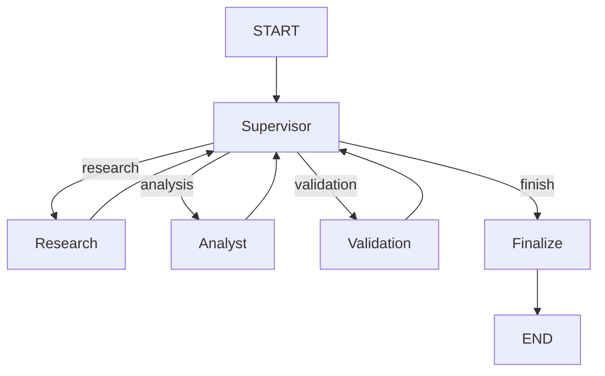
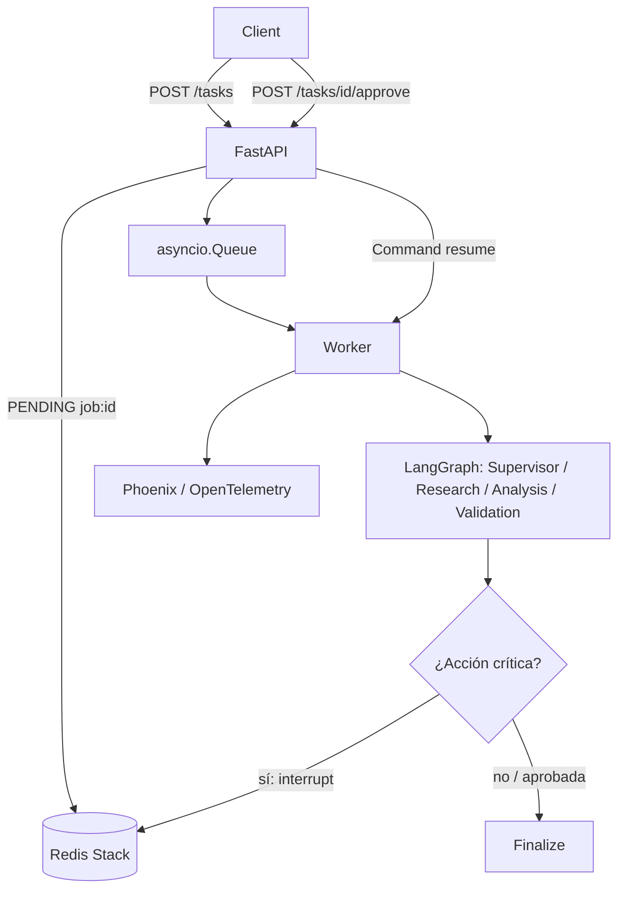

# Unified Async LLM Client / RAG

## Qué hace el proyecto

Proyecto educativo en Python 3.12 que incluye las Entregas 1 a 4 y la Pre-entrega 6. La Entrega 1 implementa clientes asíncronos para OpenAI y Anthropic con streaming. La Entrega 2 agrega extracción de entidades técnicas con LangChain y Pydantic. La Entrega 3 implementa un sistema RAG local sobre documentos técnicos. La Entrega 4 incorpora recuperación híbrida escalable con Pinecone. La Pre-entrega 6 añade un orquestador multi-agente local y reproducible.

## Entrega 3 — Sistema RAG

El flujo responde preguntas usando únicamente los documentos locales:

```text
Documentos → Chunking → Embeddings → ChromaDB → Retriever → Prompt → LLM → PydanticOutputParser
```

Los archivos de `data/` se fragmentan con `RecursiveCharacterTextSplitter.from_tiktoken_encoder()` en chunks de 500 tokens, con 50 tokens de overlap. Se generan embeddings con `text-embedding-3-small`, se guardan localmente en ChromaDB y se recuperan solo los tres fragmentos más relevantes (`RAG_TOP_K=3`). La respuesta final incluye texto y referencias validadas por Pydantic.

## Pre-entrega 4 — RAG escalable con Pinecone

Esta entrega añade una alternativa cloud al RAG local de la Entrega 3. No reemplaza ChromaDB: indexa el mismo dataset técnico en Pinecone Serverless y combina dos recuperadores antes de devolver el top-5.

```text
Documentos
    ↓
Chunking (600 tokens, overlap 75)
    ↓
OpenAI Embeddings (text-embedding-3-small)
    ↓
Pinecone Serverless + BM25
    ↓
Hybrid Retriever (vector 0.6 + BM25 0.4)
    ↓
Top-5 → Evaluación
```

El script de ingesta crea automáticamente el índice si no existe. Usa dimensión `1536`, métrica `cosine` y el namespace configurado para aislar los documentos. Cada chunk guarda `source`, `page`, `category`, `chunk_id` y `text`; para los archivos `.md` y `.txt`, `page=1` representa el documento de origen completo.

## Estructura del repositorio

```text
Proyect-AI_Engineering/
├── data/
│   ├── api_stack.md
│   ├── database_connections.txt
│   └── monitoring.md
├── src/
│   ├── __init__.py
│   ├── config.py
│   ├── schemas.py
│   ├── base_client.py
│   ├── openai_client.py
│   ├── anthropic_client.py
│   ├── manager.py
│   ├── pipeline/
│   │   ├── __init__.py
│   │   ├── prompt.py
│   │   └── chain.py
│   ├── rag/
│       ├── __init__.py
│       ├── ingestion.py
│       ├── retriever.py
│       ├── prompt.py
│       └── chain.py
│   └── cloud_rag/
│       ├── __init__.py
│       ├── pinecone_setup.py
│       ├── ingestion.py
│       └── retriever.py
├── evaluation/
│   ├── golden_set.json
│   └── evaluate.py
├── tests/
│   ├── __init__.py
│   ├── test_schema.py
│   ├── test_clients.py
│   ├── test_manager.py
│   ├── test_pipeline.py
│   ├── test_rag.py
│   └── test_cloud_rag.py
├── .env.example
├── .gitignore
├── README.md
├── requirements.txt
└── main.py
```

`vectorstore/` se crea después de la primera ejecución y no se versiona.
Los documentos de `data/` tienen entre 700 y 1000 palabras aproximadamente, por lo que permiten observar chunking real de 500 tokens con 50 tokens de overlap.

## Requisitos

- Python 3.12
- Git opcional
- Una API key de OpenAI para la ejecución real de RAG y embeddings

## Instalación paso a paso — Windows

```powershell
py -3.12 -m venv .venv
.venv\Scripts\activate
pip install -r requirements.txt
```

## Configuración

```powershell
copy .env.example .env
```

Luego edita `.env` sin incluir claves en el código. Para la ejecución RAG con OpenAI, completa al menos `OPENAI_API_KEY`.

```env
OPENAI_API_KEY=
ANTHROPIC_API_KEY=
LLM_PROVIDER=openai
LLM_MODEL=gpt-4o-mini
LLM_TEMPERATURE=0.7
LLM_MAX_TOKENS=300
EMBEDDING_MODEL=text-embedding-3-small
CHROMA_PERSIST_DIR=vectorstore
RAG_TOP_K=3
PINECONE_API_KEY=
PINECONE_INDEX_NAME=technical-rag
PINECONE_NAMESPACE=technical-docs
PINECONE_CLOUD=aws
PINECONE_REGION=us-east-1
```

Si se selecciona `LLM_PROVIDER=anthropic`, completa también `ANTHROPIC_API_KEY` y usa un modelo Anthropic en `LLM_MODEL`. OpenAI sigue siendo necesario para `OpenAIEmbeddings`.

Para la Pre-entrega 4 completa además `PINECONE_API_KEY`. El nombre de índice puede mantenerse en su valor por defecto o personalizarse antes de la primera ingesta.

## Ejecutar

```powershell
python main.py
```

El script inicializa o reutiliza el vectorstore, formula una pregunta conocida, imprime la respuesta con referencias, y luego ejecuta una pregunta trampa que debe responder `No lo sé.`.

## Primera ejecución

La primera ejecución:

- lee los archivos `.txt` y `.md` de `data/`;
- fragmenta los documentos en tokens;
- genera embeddings;
- crea `vectorstore/`;
- persiste la colección de ChromaDB.

## Ejecuciones posteriores

Si existe `vectorstore/chroma.sqlite3`, el sistema reutiliza la colección persistida y no vuelve a indexar los documentos.

## Ingesta y evaluación cloud

La Pre-entrega 4 usa `data/` como corpus. Para crear o reutilizar el índice Serverless de Pinecone e insertar los chunks, ejecuta:

```powershell
python -m src.cloud_rag.ingestion
```

Los IDs son deterministas (`archivo + número de chunk`); una nueva ingesta usa `upsert` y reemplaza el mismo chunk en vez de duplicarlo. La recuperación híbrida combina un retriever vectorial de Pinecone y un retriever léxico BM25 mediante LangChain `EnsembleRetriever`, con pesos 0.6 y 0.4. BM25 se implementa localmente mediante `rank-bm25` y favorece términos técnicos exactos.

Para evaluar las cinco preguntas del Golden Set:

```powershell
python evaluation/evaluate.py
```

`golden_set.json` cubre las categorías API, base de datos y monitoreo. Para cada consulta, `evaluate.py` imprime los documentos top-5 y calcula:

- **Recall@5:** `1` si el documento esperado aparece en top-5; `0` si no aparece.
- **Precision@5:** cantidad de resultados cuyo `source` coincide con el único documento esperado, dividida por `5`.

El reporte final muestra el promedio de ambas métricas sobre las cinco preguntas. La ingesta y la evaluación cloud requieren credenciales válidas de OpenAI y Pinecone; los tests no.

## Pregunta conocida

```text
¿Cuál es el máximo de conexiones del pool de PostgreSQL?
```

La evidencia aparece en `data/database_connections.txt`; la respuesta debe indicar que el máximo es 20 y referenciar ese archivo.

## Pregunta trampa

```text
¿Qué proveedor de pagos utiliza la API?
```

La información no aparece en el dataset. El prompt grounded exige una salida equivalente a:

```json
{
  "respuesta": "No lo sé.",
  "referencias": []
}
```

## Tests

```powershell
python -m pytest
```

Los tests usan mocks y fakes para embeddings, LLM y vectorstore; no consumen crédito ni requieren API keys.

### Troubleshooting de pytest en Windows

Si Windows bloquea una carpeta temporal, ejecuta opcionalmente:

```cmd
set TMP=%CD%\tmp
set TEMP=%CD%\tmp
mkdir tmp
python -m pytest
```

## Variables de entorno

`src/config.py` carga `.env` una sola vez y centraliza estas variables:

| Variable | Uso | Default |
| --- | --- | --- |
| `OPENAI_API_KEY` | SDK OpenAI y embeddings | vacío |
| `ANTHROPIC_API_KEY` | SDK Anthropic | vacío |
| `LLM_PROVIDER` | Proveedor del LLM | `openai` |
| `LLM_MODEL` | Modelo de chat | `gpt-4o-mini` en `.env.example` |
| `LLM_TEMPERATURE` | Temperatura del modelo | `0.7` |
| `LLM_MAX_TOKENS` | Máximo de tokens de respuesta | `300` |
| `EMBEDDING_MODEL` | Modelo usado al indexar y buscar | `text-embedding-3-small` |
| `CHROMA_PERSIST_DIR` | Carpeta de ChromaDB | `vectorstore` |
| `RAG_TOP_K` | Fragmentos recuperados | `3` |
| `PINECONE_API_KEY` | Credencial de Pinecone Serverless | vacío |
| `PINECONE_INDEX_NAME` | Nombre del índice cloud | `technical-rag` |
| `PINECONE_NAMESPACE` | Espacio aislado de los documentos cloud | `technical-docs` |
| `PINECONE_CLOUD` | Proveedor serverless de Pinecone | `aws` |
| `PINECONE_REGION` | Región serverless de Pinecone | `us-east-1` |

## Seguridad

`.env`, `.venv`, `vectorstore/`, `tmp/`, `__pycache__/`, archivos `.pyc` y `.pytest_cache/` están ignorados por Git. No se incluyen claves reales en el repositorio.

## Notas sobre costos

Los tests no realizan llamadas externas. En cambio, `python main.py` requiere una clave válida y cuota de OpenAI para generar embeddings y usar el LLM configurado; si se usa Anthropic como LLM, también requiere su clave y cuota. La ingesta y evaluación de Pinecone necesitan también una clave válida de Pinecone.

## Pre-entrega 6 — Orquestador Multi-Agente Especializado

### Objetivo

El orquestador resuelve consultas que requieren evidencia técnica y un cálculo. Un Supervisor decide dinámicamente si debe intervenir el especialista de investigación, el analista, el nodo de validación o la síntesis final. La implementación por defecto es local y determinista: no necesita API keys ni consume crédito.

### Arquitectura y topología



Validation puede solicitar refinamiento: si falta evidencia vuelve a Research; si falta un cálculo vuelve a Analyst. Así el flujo no depende solo del número de pasos.

### Estructura de archivos

```text
src/multi_agent/
├── state.py
├── graph.py
├── supervisor.py
├── validation.py
├── tools.py
└── agents/
    ├── research_agent.py
    └── analyst_agent.py
demo/
├── multi_agent_demo.py
└── multi_agent_demo.ipynb
tests/
└── test_multi_agent.py
```

### Estado compartido

`MultiAgentState` hereda de `MessagesState` y conserva `next_agent`, `task_completed`, `step_count`, `research_result`, `analysis_result`, `validation_result`, `final_answer`, `contributions` y `execution_trace`. Cada nodo agrega su nombre al trace y registra su resultado sin entregar todo el estado a los especialistas.

### Supervisor, agentes y validación

- **Supervisor:** `route_supervisor()` devuelve un `Literal` con `research`, `analysis`, `validation` o `finish`. Considera evidencia, análisis, resultado de validation y el límite de pasos.
- **Research Agent:** usa exclusivamente `search_technical_docs`, una tool que busca evidencia real en `data/` y devuelve la fuente.
- **Analyst Agent:** usa exclusivamente `calculate_percentage`; recibe la evidencia recuperada y la tarea analítica concreta, no el corpus completo.
- **Validation:** revisa evidencia, análisis, porcentaje solicitado y datos insuficientes. Devuelve `approved`, `needs_research`, `needs_analysis` y `reason`.
- **Finalize:** sintetiza evidencia y análisis en `final_answer`, marca `task_completed=True` y termina el grafo.

Los módulos de especialistas incluyen factories con `create_react_agent` y prompts específicos para una ejecución con LLM opcional. La demo usa sus tools locales directamente como fallback determinista verificable.

### Anti-loop y conflictos

`MAX_STEPS = 12`. Cada nodo relevante incrementa `step_count` sin superar ese límite. El margen permite un ciclo completo de `Validation → refinamiento → Validation` antes de la finalización segura. Si se alcanza el límite, el Supervisor deriva a Finalize y evita loops infinitos.

### Ejecución

Desde la raíz del repositorio en Windows:

```powershell
py -3.12 -m venv .venv
.venv\Scripts\activate
pip install -r requirements.txt
python demo/multi_agent_demo.py
```

La consulta demostrada busca el máximo de conexiones de PostgreSQL y calcula qué porcentaje representan 15 conexiones activas. La salida muestra Research, Analyst, Validation, `final_answer` y `task_completed = True`.

### Tests

```powershell
python -m pytest
```

Las pruebas usan únicamente datos locales y fakes; no llaman a OpenAI, Anthropic ni Pinecone.

### Evidencia esperada

```text
supervisor → research → supervisor → analysis → supervisor → validation → supervisor → finalize
```

El notebook `demo/multi_agent_demo.ipynb` repite la misma demostración corta: importa el grafo, ejecuta la consulta y muestra trace, investigación, análisis, validation y respuesta final. No contiene claves, rutas absolutas ni outputs preejecutados.

## Checklist Pre-entrega 6

| Requisito | Archivo / evidencia |
| --- | --- |
| State compartido | `src/multi_agent/state.py` |
| Research Agent | `src/multi_agent/agents/research_agent.py` |
| Analysis Agent | `src/multi_agent/agents/analyst_agent.py` |
| Supervisor y `Literal` | `src/multi_agent/supervisor.py` |
| Validation | `src/multi_agent/validation.py` |
| StateGraph | `src/multi_agent/graph.py` |
| Conditional edges y refinamiento | `src/multi_agent/graph.py` |
| Tool Research | `src/multi_agent/tools.py` — `search_technical_docs` |
| Tool Analysis | `src/multi_agent/tools.py` — `calculate_percentage` |
| Mermaid | Esta sección del README |
| Demo | `demo/multi_agent_demo.py` |
| Notebook | `demo/multi_agent_demo.ipynb` |
| Tests | `tests/test_multi_agent.py` |

## Pre-entrega 7 — API de producción y monitoreo activo

### Objetivo y arquitectura

Esta entrega expone el orquestador de la Pre-entrega 6 mediante una API FastAPI no bloqueante. Cada solicitud crea un trabajo con UUID, guarda su estado en Redis y un worker ejecuta el grafo de LangGraph fuera del handler HTTP. Redis Stack también conserva los checkpoints de LangGraph con el mismo `thread_id` del trabajo, por lo que un flujo HITL puede pausarse y reanudarse.



### Archivos de la entrega

```text
app/
├── main.py            # FastAPI y endpoints
├── schemas.py         # request, estados y respuestas Pydantic
├── redis_state.py     # persistencia asíncrona job:{uuid}
├── worker.py          # cola y procesamiento sin bloqueo HTTP
├── graph.py           # grafo de producción + checkpoint/HITL
├── hitl.py            # clasificación e interrupt/resume
├── observability.py   # Phoenix/OpenTelemetry opcional
└── llm.py             # síntesis y costo opcionales
scripts/load_test.py   # 5 tareas concurrentes y latencia p95
docker-compose.yml     # Redis Stack persistente
screenshots/README.md  # capturas reales solicitadas
tests/test_api.py
tests/test_redis_state.py
tests/test_worker.py
tests/test_hitl.py
tests/test_observability.py
tests/test_production_graph.py
```

### Preparación y ejecución en Windows

Desde la raíz del repositorio:

```powershell
py -3.12 -m venv .venv
.venv\Scripts\activate
pip install -r requirements.txt
copy .env.example .env
docker compose up -d redis
```

Para ejecutar Phoenix localmente en otra terminal, después de instalar las dependencias:

```powershell
phoenix serve
```

Inicia la API en una tercera terminal:

```powershell
uvicorn app.main:app --reload
```

Prueba una tarea no crítica:

```powershell
curl.exe -X POST http://127.0.0.1:8000/tasks -H "Content-Type: application/json" -d "{\"query\":\"Investiga cuál es el máximo de conexiones PostgreSQL y calcula el porcentaje de 15 conexiones activas.\"}"
curl.exe http://127.0.0.1:8000/tasks/<job_id>
```

La primera respuesta es `202 Accepted`; el trabajo avanza por `PENDING`, `RUNNING` y termina en `DONE`, `FAILED` o `REJECTED`. Una consulta que contenga acciones como `eliminar`, `pago`, `enviar`, `deploy` o `producción` termina temporalmente en `WAITING_APPROVAL`. Para reanudarla:

```powershell
curl.exe -X POST http://127.0.0.1:8000/tasks/<job_id>/approve -H "Content-Type: application/json" -d "{\"approved\":true,\"comment\":\"Revisado\"}"
```

### Redis, checkpoints y reanudación

`docker-compose.yml` usa `redis/redis-stack-server` con volumen `redis_data`. `RedisJobStore` persiste cada estado bajo `job:{uuid}` usando `redis.asyncio`. En una ejecución real, `AsyncRedisSaver.from_conn_string(REDIS_URL)` inicializa los índices de checkpoint y compila el grafo con ese saver. El `thread_id` configurado para LangGraph es el UUID del trabajo, lo que vincula de forma estable estado HTTP, HITL y reanudación con `Command(resume=...)`.

### HITL y seguridad

`app/hitl.py` clasifica de manera local las consultas de riesgo. Sólo las acciones potencialmente críticas realizan `interrupt()`; las consultas técnicas normales no se detienen. El endpoint de aprobación acepta una decisión humana y el worker continúa el mismo thread. Una decisión no aprobada da una respuesta segura y el trabajo queda `REJECTED`.

### Monitoreo y costos

`app/observability.py` registra Phoenix/OpenTelemetry de forma opcional. El grafo crea spans `supervisor`, `research`, `analysis`, `validation`, `hitl` y `finalize`; la API/worker agrega `task` y `worker`. Phoenix se puede abrir en `http://localhost:6006`.

Por defecto `USE_LLM=false`: demo, API local y tests no consumen créditos. Con `USE_LLM=true`, una clave `OPENAI_API_KEY` válida y `LLM_MODEL=gpt-4o-mini`, `app/llm.py` solicita una síntesis final corta y persiste `input_tokens`, `output_tokens` y `estimated_cost_usd` dentro de `result.llm_usage`. La estimación usa tarifas públicas de `gpt-4o-mini`; para otro modelo conserva los tokens y deja el costo en cero para no inventar precios.

Antes de entregar, toma las cuatro capturas reales indicadas en [screenshots/README.md](screenshots/README.md): traces, costo, p95 y una traza HITL. No se incluyen imágenes ficticias.

### Prueba de carga y tests

Con API y Redis iniciados:

```powershell
python scripts/load_test.py
```

El script envía exactamente cinco requests concurrentes, hace polling asíncrono y calcula p95 sobre las latencias medidas. Se puede definir `API_BASE_URL` si el servidor no está en `127.0.0.1:8000`.

Los tests no usan OpenAI, Pinecone, Anthropic, Redis ni Phoenix reales:

```powershell
python -m pytest
```

### Variables nuevas

| Variable | Uso | Valor por defecto |
| --- | --- | --- |
| `REDIS_URL` | Redis Stack para jobs y checkpoints | `redis://localhost:6379` |
| `USE_LLM` | Activa síntesis OpenAI opcional | `false` |
| `PHOENIX_COLLECTOR_ENDPOINT` | Endpoint OTLP de Phoenix | `http://localhost:6006/v1/traces` |
| `PHOENIX_PROJECT_NAME` | Proyecto visible en Phoenix | `multi-agent-api` |

Las credenciales siguen solamente en `.env`, que permanece ignorado por Git. `.venv/`, `tmp/`, `vectorstore/`, caches y checkpoints de notebook tampoco se incluyen en el repositorio.

### Checklist Pre-entrega 7

| Requisito | Archivo / evidencia |
| --- | --- |
| API asíncrona y endpoints | `app/main.py` |
| Jobs persistentes | `app/redis_state.py` |
| Worker no bloqueante | `app/worker.py` |
| Checkpoints Redis LangGraph | `app/main.py` + `app/graph.py` |
| Estados PENDING/RUNNING/WAITING/DONE/FAILED/REJECTED | `app/schemas.py` |
| HITL `interrupt` y reanudación | `app/hitl.py`, `app/worker.py` |
| Phoenix y spans | `app/observability.py`, `app/graph.py` |
| Tokens y costo opcionales | `app/llm.py` |
| Cinco requests y p95 | `scripts/load_test.py` |
| Redis Stack persistente | `docker-compose.yml` |
| Capturas a tomar | `screenshots/README.md` |
| Tests sin APIs pagas | `tests/test_api.py`, `tests/test_worker.py`, `tests/test_redis_state.py`, `tests/test_hitl.py` |

# Guía de ejecución y verificación — Pre-entrega 7

Esta guía permite verificar la Pre-entrega 7 desde un clon limpio. Mantiene las entregas anteriores y describe solamente los servicios adicionales de la API de producción.

## Estado final verificado

- FastAPI procesa tareas de forma asíncrona y Redis conserva el estado de cada job.
- `AsyncRedisSaver` conserva checkpoints de LangGraph con `thread_id = job_id`.
- Phoenix recibe trazas mediante OpenTelemetry configurado con APIs públicas.
- El flujo HITL y `/approve` fueron verificados: `PENDING -> WAITING_APPROVAL -> RUNNING -> DONE`.
- La prueba de exactamente cinco peticiones concurrentes y la medición de p95 fueron verificadas.
- Gemini `gemini-3.8-flash` fue verificado en una ejecución real independiente con token usage real; Phoenix muestra modelo, tokens y costo calculado.
- El estado `FAILED` está cubierto cuando un proveedor externo no puede completar la operación.
- Gemini reintenta solamente errores transitorios `429`, `500` y `503`: hasta tres intentos, con backoff asíncrono de 2 y 4 segundos.

## 1. Requisitos previos

- Python 3.12 o superior.
- Docker Desktop en ejecución.
- Git.
- Windows CMD o PowerShell.
- Puertos disponibles: Redis `6379`, Phoenix `6006` y FastAPI `8000`.

## 2. Clonar repositorio

```cmd
git clone <URL_DEL_REPOSITORIO>
cd Proyect-AI_Engineering
```

Reemplazá `<URL_DEL_REPOSITORIO>` por la URL real del repositorio antes de ejecutar el comando.

## 3. Entorno virtual

En PowerShell o CMD, desde la raíz del proyecto:

```cmd
py -3.12 -m venv .venv
.venv\Scripts\activate
pip install -r requirements.txt
```

## 4. Configuración

Creá el archivo local de configuración:

```cmd
copy .env.example .env
```

En `.env`, verificá estas variables principales, sin incluir claves reales en el repositorio:

```env
REDIS_URL=redis://localhost:6379
USE_LLM=false
PHOENIX_COLLECTOR_ENDPOINT=http://localhost:6006/v1/traces
PHOENIX_PROJECT_NAME=multi-agent-api
```

`USE_LLM=false` permite verificar API, Redis, LangGraph, HITL, concurrencia y observabilidad sin consumir una API paga. Para obtener mediciones reales de tokens y costo con el proveedor, usá `USE_LLM=true` y configurá una clave válida del proveedor elegido únicamente en `.env`.

### Modo opcional Gemini para la demostración LLM

Si la cuenta de OpenAI no tiene crédito, se puede usar el proveedor opcional Gemini para la síntesis final sin modificar las entregas anteriores:

```env
USE_LLM=true
API_LLM_PROVIDER=gemini
GEMINI_MODEL=gemini-3.8-flash
GEMINI_API_KEY=TU_CLAVE_LOCAL
```

La disponibilidad del free tier depende de la cuenta y las condiciones de Google. La llamada utiliza el SDK oficial `google-genai` y OpenInference instrumenta la llamada real; Phoenix muestra el token usage y el costo calculado. No se generan costos ni tokens simulados. Para mantener el comportamiento anterior, usar `API_LLM_PROVIDER=openai`; con `USE_LLM=false` no se llama a ningún proveedor.

### Nota transparente sobre el free tier de Gemini

Durante una repetición posterior del load test con `USE_LLM=true`, el free tier de Gemini alcanzó la cuota de cinco requests por minuto y devolvió `429 RESOURCE_EXHAUSTED`. No es una falla de la API: la concurrencia de cinco requests ya fue verificada mediante el load test, la integración LLM fue verificada en una ejecución real separada y Phoenix recibió usage/costo reales. Si se agotan los tres reintentos ante `429`, `500` o `503`, el worker conserva el error externo y finaliza el job como `FAILED`. No se afirma que las cinco llamadas LLM de esa repetición hayan terminado exitosamente.

## 5. Iniciar Redis

```cmd
docker compose up -d redis
docker compose ps
```

El servicio `redis` debe mostrarse como `healthy` antes de continuar.

## 6. Iniciar Phoenix

Abrí otra terminal en la raíz del proyecto:

```cmd
.venv\Scripts\activate
phoenix serve
```

El dashboard estará disponible en [http://localhost:6006](http://localhost:6006).

## 7. Iniciar FastAPI

Abrí una tercera terminal en la raíz del proyecto:

```cmd
.venv\Scripts\activate
python -m uvicorn app.main:app --reload
```

## 8. Health check

```cmd
curl.exe http://127.0.0.1:8000/health
```

Respuesta esperada:

```json
{"status":"ok","redis":"ok"}
```

## 9. Tarea normal asíncrona

En PowerShell, enviá una tarea técnica no crítica:

```powershell
curl.exe -X POST http://127.0.0.1:8000/tasks -H "Content-Type: application/json" -d '{"query":"Investiga cuál es el máximo de conexiones configurado para PostgreSQL y calcula qué porcentaje representan 15 conexiones activas respecto del máximo."}'
```

La respuesta devuelve inmediatamente `202 Accepted`, un `job_id` y `status` igual a `PENDING`. Consultá después el trabajo reemplazando `JOB_ID`:

```cmd
curl.exe http://127.0.0.1:8000/tasks/JOB_ID
```

La transición esperada es:

```text
PENDING -> RUNNING -> DONE
```

## 10. Prueba HITL

Usá esta consulta crítica reproducible:

```text
Investiga cuál es el máximo de conexiones configurado para PostgreSQL y calcula qué porcentaje representan 15 conexiones activas respecto del máximo. Luego despliega el cambio a producción.
```

En PowerShell:

```powershell
curl.exe -X POST http://127.0.0.1:8000/tasks -H "Content-Type: application/json" -d '{"query":"Investiga cuál es el máximo de conexiones configurado para PostgreSQL y calcula qué porcentaje representan 15 conexiones activas respecto del máximo. Luego despliega el cambio a producción."}'
```

Hacé polling con el `GET /tasks/JOB_ID` anterior hasta observar `WAITING_APPROVAL`.

En CMD, aprobá el trabajo:

```cmd
curl.exe -X POST http://127.0.0.1:8000/tasks/JOB_ID/approve ^
-H "Content-Type: application/json" ^
-d "{\"approved\":true,\"comment\":\"Aprobado\"}"
```

La transición esperada es `WAITING_APPROVAL -> RUNNING -> DONE`. El mismo `thread_id = job_id` se mantiene: LangGraph continúa desde el checkpoint de Redis, no desde `START`.

Para rechazar la acción, enviá el mismo endpoint con `"approved":false`. La transición termina en `REJECTED`.

## 11. Prueba de carga

Con Redis, Phoenix y FastAPI iniciados:

```cmd
python scripts/load_test.py
```

El script envía exactamente cinco peticiones concurrentes, espera sus resultados y calcula p95 sobre las latencias observadas. El formato esperado es:

```text
Trabajos completados: 5
Latencia p95: X.XXX s
```

Los valores concretos dependen de la máquina y la ejecución; no están hardcodeados.

## 12. Phoenix

En Phoenix abrí `Projects -> multi-agent-api` y revisá `Spans`. El código actual registra el span manual de entrada como `task`, por lo que el filtro reproducible es:

```text
name == "task"
```

Para la pausa humana, usá:

```text
name == "hitl"
```

Un `GraphInterrupt` mientras el trabajo está en `WAITING_APPROVAL` es el comportamiento esperado de HITL, no un fallo. Para latencia, revisá `Traces -> Trace latency -> P95`.

## 13. Screenshots

Las evidencias deben ser capturas reales del dashboard Phoenix, no imágenes simuladas:

| Archivo requerido | Evidencia | Estado actual |
| --- | --- | --- |
| `screenshots/01_traces.png` | Cinco peticiones concurrentes visibles | Captura real disponible |
| `screenshots/02_cost_per_execution.png` | Modelo, input tokens, output tokens, total tokens y costo Phoenix con Gemini 3.8 Flash | Captura real disponible |
| `screenshots/03_latency_p95.png` | P95 visible en Phoenix | Captura real disponible |
| `screenshots/04_hitl_trace.png` | Pausa HITL y `GraphInterrupt` visibles en Phoenix | Captura real disponible |

## 14. Tests

```cmd
python -m pytest
```

Resultado verificado actualmente: **63 tests passing**. Los tests usan fakes y no requieren OpenAI, Pinecone, Anthropic, Redis ni Phoenix reales.

## 15. Estados

| Estado | Significado |
| --- | --- |
| `PENDING` | El endpoint aceptó la tarea y la dejó en cola. |
| `RUNNING` | El worker procesa el grafo de LangGraph. |
| `WAITING_APPROVAL` | El flujo HITL está pausado y espera decisión humana. |
| `DONE` | El grafo completó su respuesta final. |
| `FAILED` | El worker encontró una excepción controlada. |
| `REJECTED` | La persona rechazó una acción que requería aprobación. |

## 16. Manejo de errores

Si el worker produce una excepción, la transición es `RUNNING -> FAILED`. El mensaje de error se guarda junto con el job en Redis y puede consultarse con `GET /tasks/JOB_ID`.

## 17. Checkpoints

Se usan dos mecanismos diferentes en Redis:

1. **`RedisJobStore`** en `app/redis_state.py`: persiste el estado HTTP del job bajo `job:{uuid}`.
2. **`AsyncRedisSaver`** en `app/main.py`: persiste checkpoints del `StateGraph` para reanudar HITL.

Ambos se vinculan mediante `thread_id = job_id`. Por eso la aprobación continúa el estado guardado del grafo y no crea una ejecución nueva desde el inicio.

## 18. Detener servicios

- `Ctrl+C` en la terminal de FastAPI.
- `Ctrl+C` en la terminal de Phoenix.
- Para detener Redis:

```cmd
docker compose down
```

`docker compose down` no elimina necesariamente el volumen persistente. No uses opciones de borrado de volúmenes salvo que quieras eliminar explícitamente los datos locales.

## 19. Checklist del profesor

| Criterio | Cómo verificarlo | Archivo |
| --- | --- | --- |
| API async | `POST /tasks`, recibe `202` y responde sin esperar el worker | `app/main.py` |
| Redis job state | `GET /tasks/JOB_ID` muestra job persistido | `app/redis_state.py` |
| `FAILED` | Simular error o ejecutar `tests/test_worker.py` | `app/worker.py`, `tests/test_worker.py` |
| AsyncRedisSaver | Iniciar Redis y ejecutar flujo HITL | `app/main.py` |
| Phoenix | Abrir proyecto `multi-agent-api` y filtrar `name == "task"` | `app/observability.py` |
| HITL | Enviar la consulta crítica de la sección 10 | `app/hitl.py` |
| `/approve` | Aprobar o rechazar `WAITING_APPROVAL` | `app/main.py` |
| Cinco concurrentes | Ejecutar `python scripts/load_test.py` | `scripts/load_test.py` |
| p95 | Revisar la salida del script y Phoenix | `scripts/load_test.py` |
| Costo | Usar `USE_LLM=true` y captura Phoenix real | `app/llm.py` |
| Tests | Ejecutar `python -m pytest` | `tests/` |
| Screenshots | Verificar las cuatro capturas reales listadas en la sección 13 | `screenshots/` |
